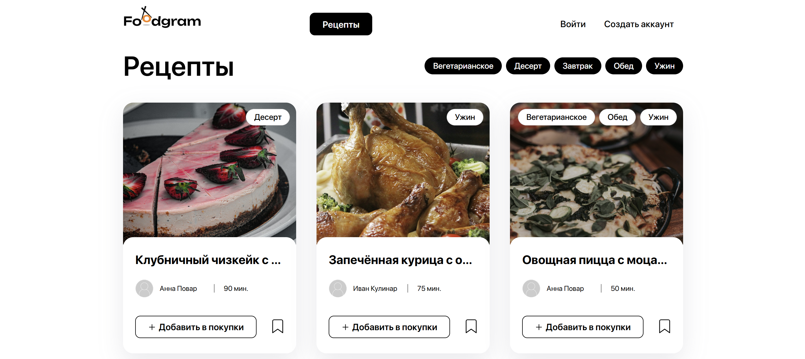
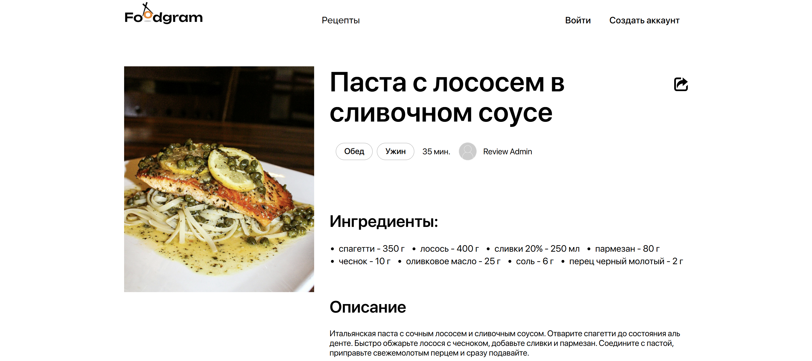
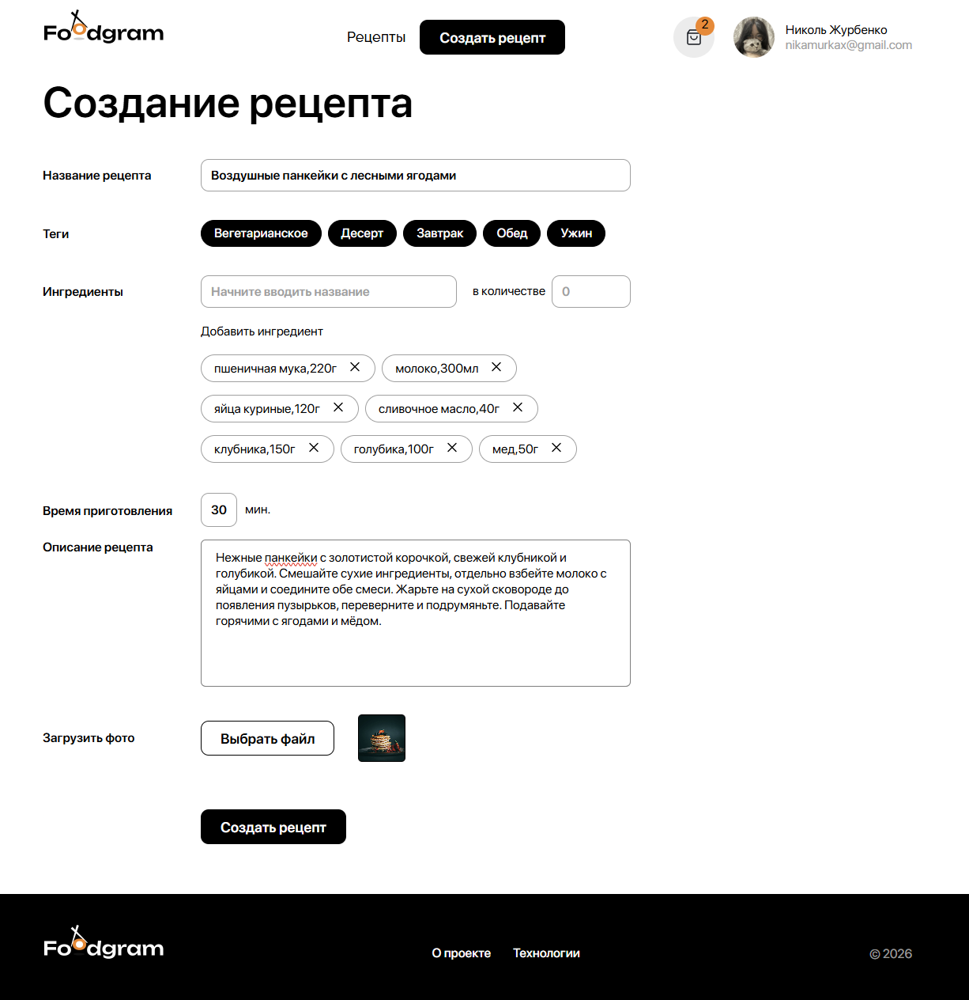
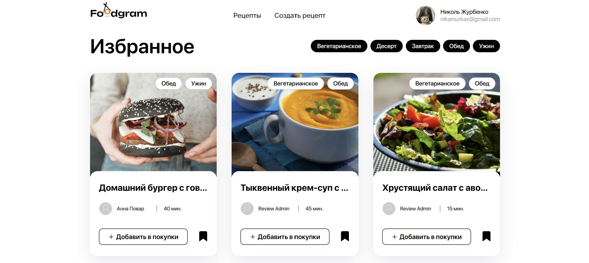
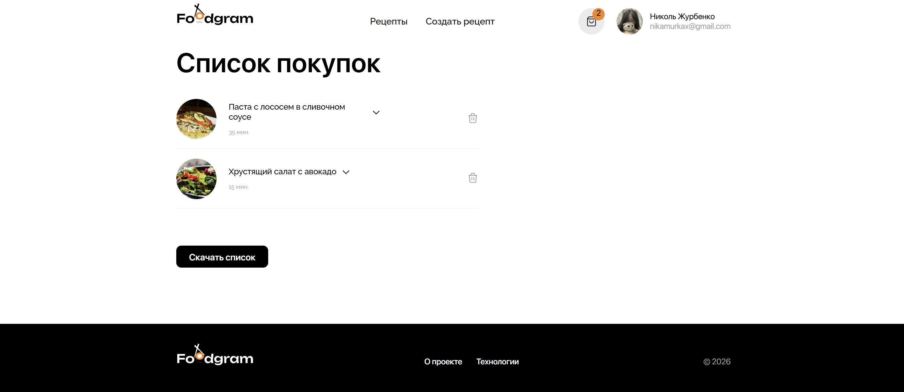

**English** | [Русский](README.ru.md)

# Foodgram

A full-stack recipe sharing and shopping planning service with a **Django REST Framework** REST API, a React interface, and PostgreSQL.

Foodgram lets users publish recipes with photos and ingredients, follow authors, save favorite dishes, and generate a combined shopping list. The backend implements a custom user model, permissions, filtering, image handling, and related user collections.

## Features

- user registration and token authentication;
- create, edit, and delete own recipes;
- upload avatars and recipe images;
- tags and ingredients;
- filter recipes by author, tags, favorites, and shopping list;
- follow authors;
- favorite recipes;
- shopping lists that automatically sum matching ingredients;
- export shopping lists as text;
- short recipe links;
- Django admin panel;
- OpenAPI/ReDoc documentation;
- Docker Compose to run the frontend, backend, PostgreSQL, and Nginx.

## Interface

### Recipe catalog



### Recipe page



### Creating a recipe



### Favorites



### Shopping list



## Technology stack

| Component | Technologies |
| --- | --- |
| Backend | Python, Django 4.2, Django REST Framework 3.15 |
| Authentication | Djoser, Token Authentication |
| Filtering | django-filter |
| Database | PostgreSQL 16, psycopg 3 |
| Frontend | React 17, React Router 5, Vite 8 |
| Web server | Gunicorn, Nginx |
| Infrastructure | Docker, Docker Compose, named volumes |
| CI | GitHub Actions: frontend build and dependency audit |
| API docs | OpenAPI 3, ReDoc |

## Backend architecture

```text
backend/
├── api/        # serializers, views, filters, permissions, pagination
├── recipes/    # recipes, ingredients, tags, and user lists
├── users/      # custom user model and subscriptions
├── foodgram/   # Django project settings
└── manage.py
```

The REST API follows DRF's ViewSet/Serializer approach. Recipes use the object-level permission `IsAuthorOrReadOnly`: all users can read data, but only the object's author can modify or delete it.

## Main API workflows

| Workflow | Endpoint |
| --- | --- |
| Recipes | `/api/recipes/` |
| Users | `/api/users/` |
| Tags | `/api/tags/` |
| Ingredients | `/api/ingredients/` |
| Subscriptions | `/api/users/subscriptions/` |
| Favorites | `/api/recipes/{id}/favorite/` |
| Shopping list | `/api/recipes/{id}/shopping_cart/` |
| Download shopping list | `/api/recipes/download_shopping_cart/` |
| Obtain a token | `/api/auth/token/login/` |

The full OpenAPI schema is in [`docs/openapi-schema.yml`](docs/openapi-schema.yml). After starting the Docker environment, ReDoc is available at `http://localhost/api/docs/`.

## Running with Docker Compose

Clone the repository:

```bash
git clone https://github.com/nikamurkaa/foodgram.git
cd foodgram
```

Create the environment file:

```bash
cp infra/.env.example infra/.env
```

Example configuration:

```dotenv
POSTGRES_DB=foodgram
POSTGRES_USER=foodgram
POSTGRES_PASSWORD=change-me
DB_HOST=db
DB_PORT=5432
SECRET_KEY=change-me-to-a-long-random-value
DEBUG=False
ALLOWED_HOSTS=localhost,127.0.0.1
DEMO_USER_PASSWORD=change-me
```

Build and start the services:

```bash
docker compose -f infra/docker-compose.yml up -d --build
```

Check container status:

```bash
docker compose -f infra/docker-compose.yml ps
```

After startup, the interface is available at `http://localhost` and the API at `http://localhost/api/`.

Stop the project:

```bash
docker compose -f infra/docker-compose.yml down
```

## Populating the database

Load ingredients:

```bash
docker compose -f infra/docker-compose.yml exec backend \
  python manage.py load_ingredients
```

Create demonstration data:

```bash
docker compose -f infra/docker-compose.yml exec backend \
  python manage.py seed_demo
```

A command is also provided to load a showcase recipe collection:

```bash
docker compose -f infra/docker-compose.yml exec backend \
  python manage.py load_showcase_recipes
```

## API examples

Obtain a token:

```bash
curl --request POST http://localhost/api/auth/token/login/ \
  --header 'Content-Type: application/json' \
  --data '{
    "email": "user@example.com",
    "password": "your-password"
  }'
```

Retrieve the first page of recipes:

```bash
curl 'http://localhost/api/recipes/?limit=5'
```

Add a recipe to favorites:

```bash
curl --request POST http://localhost/api/recipes/1/favorite/ \
  --header 'Authorization: Token <auth_token>'
```

## Code quality checks

Backend dependencies are installed from `backend/requirements.txt`.

```bash
cd backend
python -m pip install -r requirements.txt
flake8 .
```

The frontend requires Node.js 22.12+ (or 20.19+); Node.js 22 is recommended,
as used in the Dockerfile and CI. Check the version with `node --version`.

The frontend uses a single package manager, npm. For a reproducible build and security check:

From the repository root (return from the backend with `cd ..`):

```bash
cd frontend
npm ci
npm run build
npm audit --audit-level=high
```

The same frontend checks run automatically in GitHub Actions when dependencies, frontend source files, or its Dockerfile change.

The repository also includes [`postman_collection/`](postman_collection/) for functional API testing.

Backend tests with a separate, automatically created PostgreSQL test database:

```bash
docker compose -f infra/docker-compose.yml exec backend python manage.py test api.tests recipes.tests
```

Run the command from the repository root while the containers are running.

## Project structure

```text
foodgram/
├── backend/             # Django REST API
├── frontend/            # React + Vite application
├── infra/               # Docker Compose and Nginx
├── data/                # ingredient source data
├── docs/                # OpenAPI/ReDoc
├── postman_collection/  # manual API testing
└── README.md
```

The project was completed as part of the **Yandex Practicum Python Developer course**.

## Author

[Nicole Zhurbenko](https://github.com/nikamurkaa)
